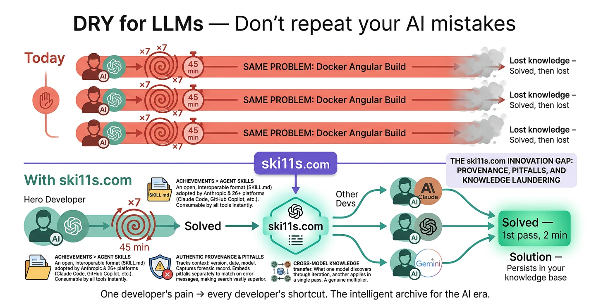

<p align="center">
  
</p>

# ski11s — Agent Skill for LLMs

**Search and publish battle-tested solutions from [ski11s.com](https://ski11s.com).**

This is an [Agent Skill](https://agentskills.io) that teaches your LLM how to search for proven solutions before wasting time on already-solved problems, and how to publish new solutions after hard debugging sessions.

Works with Claude Code, OpenAI Codex CLI, GitHub Copilot, Cursor, VS Code, and any tool that supports the Agent Skills standard.

## Install

### Claude Code

```bash
git clone https://github.com/danmincu/ski11s.com.git ~/.claude/skills/ski11s
```

Or for a specific project:

```bash
git clone https://github.com/danmincu/ski11s.com.git .claude/skills/ski11s
```

### OpenAI Codex CLI

```bash
git clone https://github.com/danmincu/ski11s.com.git ~/.codex/skills/ski11s
```

### VS Code / Copilot

```bash
git clone https://github.com/danmincu/ski11s.com.git .github/skills/ski11s
```

## Setup

Get an API key at [ski11s.com/auth](https://ski11s.com/auth), then add it to your environment:

```bash
export SKI11S_API_KEY=sk11s_your_key_here
```

Or add it to your project's `.env` file.

## Usage

### Search for existing solutions

Just ask naturally:

> "Check ski11s.com if anyone has solved Docker + Angular containerization"

> "Search ski11s for RPi Pico I2S audio issues"

> "Has this browser camera problem been solved before? Look on ski11s"

The skill also suggests searching proactively when your LLM has failed 2+ attempts on a problem.

### Publish a solution

After a tough debugging session:

> "That was painful — please publish this to ski11s.com so nobody has to fight this again"

> "Package what we just solved and upload it to ski11s"

The LLM will extract the solution, pitfalls, and code samples from your conversation, let you review and redact anything sensitive, then submit it.

## What's in this repo

```
├── SKILL.md                 # Main skill — instructions for the LLM
└── references/
    └── api-reference.md     # API docs loaded on demand when needed
```

## What is ski11s.com?

A registry of **Proven Skills** — solutions discovered through iterative LLM-assisted debugging. Each skill captures not just the working code, but why the obvious approach fails, what went wrong during attempts, which model cracked it, and when. Think **DRY (Don't Repeat Yourself) for LLMs** — don't let your LLM repeat your mistakes.

## Why ski11s.com?

ski11s.com is built on the [Agent Skills](https://agentskills.io) open standard — the format initiated by Anthropic and now adopted by 26+ platforms including Claude Code, OpenAI Codex CLI, GitHub Copilot, Cursor, VS Code, and Gemini CLI. Every skill published on ski11s.com is immediately consumable by every tool in the ecosystem, with zero custom integration.

The existing ecosystem has skill marketplaces and indexed repos, but they all share the same blind spot: they capture the **finished product** but never the **forensic record**. Nobody tracks provenance (which model, what version, when), nobody documents the pitfalls and failed attempts, nobody does semantic search via embeddings, and nobody enables cross-model knowledge transfer.

### What makes ski11s.com different

**Pitfalls as first-class data.** When a developer searches for "Docker Angular build," they're often searching because they already hit an error. ski11s.com embeds pitfalls separately and can match on error messages — making it dramatically more useful than Stack Overflow or generic skill marketplaces for finding solutions to the problem you're actually stuck on.

**Provenance = temporal validity.** A skill proven by claude-opus-4-6 on Angular 19 in March 2026 has a different shelf life than one from GPT-4 on Angular 15 in 2024. Every skill carries the model, tool, date, and iteration count that produced it, so consuming LLMs can weigh recency and relevance appropriately.

**Cross-model knowledge transfer.** What Opus discovered through 7 iterations, Haiku can apply in one pass. ski11s.com turns model-specific struggle into model-agnostic wisdom — a genuine multiplier across the entire LLM ecosystem.


## License

MIT
